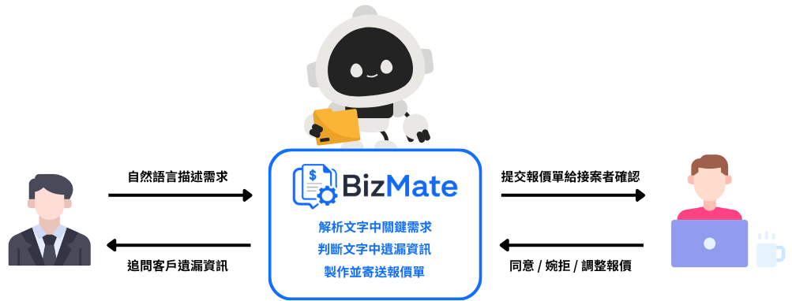

<div align="center">

# BizMate

自動報價 AI Agent。客戶用一段話描述需求，系統解析為結構化欄位、以確定性引擎計算金額，接案者審核後寄出正式報價單。

[](https://github.com/ychsieh725/BizMate/actions/workflows/ci.yml)
[](https://github.com/ychsieh725/BizMate/actions/workflows/eval.yml)




</div>

---

## 這個專案要證明的事

多數 LLM 應用在「串接 API、功能可運作」之後就停下來了。本專案的重點是把 LLM 的輸出品質變成可量測、可回歸、可以擋住合併的工程資產。

最能說明這件事的是一個具體事件。專案累積到 424 個綠燈單元測試、加上一條通過的端對端金路徑時，一個會讓報價金額算錯八倍的缺陷仍然存在於程式碼中，所有測試都沒有攔截到它。一份 36 則的人工標註資料集在首次執行時就攔截了。

原因不難理解。單元測試餵給模型的是自己寫的乾淨資料，端對端測試只斷言流程走得完、不斷言金額是否正確。**對 LLM 輸出的品質，只有跑真實模型的標註資料集擋得住。**

完整過程記錄於[用 Golden Set 抓出並修復 Parser 值域缺陷](docs/eval-driven-fix-case-study.md)。

---

## 三個工程決定

這三項決定了系統的形狀，也是本專案與一般 LLM 應用的主要差異。

### 一. 金額不經過 LLM

模型負責理解語意並抽取欄位，計價完全是查表運算。這不是 prompt 裡的約定，而是架構上的保證。

agent 用來觸發計價的工具刻意宣告為零參數，模型只能表達「我認為資訊足夠了」這個意圖，無法夾帶任何影響金額的資料。加上跨服務邊界，Python 端根本算不了價，必須呼叫 TypeScript 的計價 API。

同樣的原則套用在缺漏判定上。系統不問模型「資訊夠了嗎」，而是以 confidence 門檻在程式端判定。判準必須是穩定、可調、可被量測的，交給模型會讓它隨 prompt 微調而漂移。

三條不變式構成這個邊界。

| 編號 | 內容 | 落地方式 |
| --- | --- | --- |
| I-1 | 金額不經過 LLM | 零參數工具，跨服務邊界 |
| I-2 | 缺漏判定不經過 LLM | confidence 門檻 0.6，程式端計算 |
| I-3 | 任何異常退回既有路徑 | agent 失敗時由單步流程接手，行為與導入前一致 |

### 二. 用資料否決自己的功能

專案實作了一套完整的 tool-calling agent，包含四個工具、軌跡記錄、護欄與三重預算控制。接著建立配對統計檢定，比較它與原有單步流程的品質。

結論是不要上線。

| 判準 | 單步流程 | Agent | McNemar p |
| --- | --- | --- | --- |
| 報價正確 | 100% | 100% | 1.0000 |
| 欄位全對 | 91.7% | 91.7% | 1.0000 |
| 缺漏判定一致 | 100% | 97.2% | 1.0000 |

沒有任何統計證據顯示 agent 比較好，而成本是單步流程的三倍。客戶平均被問的題數，單步流程 1.47 題，agent 1.53 題，人工標註的正確答案也是 1.47 題。導入 agent 的產品理由是讓客戶少答幾題，這個理由沒有成立。

**feature flag 至今維持關閉。** 完整分析見 [A6 基準線對照](docs/agent-eval-a6-comparison.md)。

檢定方法選 McNemar 精確檢定而非卡方，因為兩側跑的是同一批案例而不是兩組獨立抽樣，用卡方會高估顯著性。硬門檻的區間上界也一併記錄，實測 fallback 率為 0/36，但 95% 信賴區間上界是 9.6%，這份資料無法排除真實失敗率達到該水準的可能。

### 三. 品質門檻進入 CI

指標若只是「跑完印出來給人看」，就不是機制。本專案把它接成擋合併的閘門。

每次觸及模型相關路徑的變更，GitHub Actions 會對真實 Gemini 執行完整資料集並判定九項門檻，硬門檻未達即回非零離開碼。另有每日排程，用於偵測「什麼都沒改但指標掉了」，因為模型是外部服務，供應商更換權重是常態。

門檻取 Wilson 95% 信賴區間下界，不是觀測值。這是被資料逼出來的結果。同一份資料集與同一個模型連跑三次，欄位準確率分別是 199/204、201/204、201/204，差異來自模型本身的變異而非回歸。門檻若設在觀測值 98.5%，第一次量測就會是紅燈，而那次並沒有任何東西壞掉。**會誤報的閘門會被關掉，關掉的閘門等於沒有閘門。**

閘門本身也有測試，測試資料是兩份已進版控的實測落檔。修復前那份報價偏差 700%，必須被擋下；修復後那份必須放行。附帶效果是「把門檻調鬆」這個動作本身被測試守著。

---

## 量化結果

資料集 v1.0.0，36 則人工標註案例，模型 gemini-3.1-flash-lite。

| 指標 | 基準線 | CI 門檻 |
| --- | --- | --- |
| 欄位抽取準確率 | 98.5% | 不低於 95.77% |
| 欄位抽取 F1 | 98.0% | 不低於 95.77% |
| 缺漏判定 Precision / Recall | 100% / 100% | Recall 不低於 93.24% |
| 幻覺率 | 0% | 必須為 0 |
| 端到端成功率 | 100% | 不低於 90.36% |
| 報價偏差最大值 | 0% | 不高於 10% |
| 每案成本 | $0.00048 | 僅警告 |
| Parser 延遲 P95 | 變異達 8.7 倍 | 僅警告 |

延遲降為警告是資料決定的。同一份資料連跑三次，P95 分別是 2,093ms、11,010ms、18,126ms，成本卻只差 6%。變異來自模型服務端排隊而非本專案的程式碼，拿它當門檻只會製造噪音。

專案規模。

| 項目 | 數字 |
| --- | --- |
| TypeScript | 217 檔，19,303 行，strict，禁用 any |
| Python | 78 檔，8,768 行，mypy strict |
| 測試 | TypeScript 672 則，Python 329 則 |
| 覆蓋率 | 96.4% 與 90.6% statements，門檻 80% 由 CI 把關 |
| 資料庫 | 15 張表，10 個 migrations，RLS 全表啟用 |
| 驗證腳本 | 17 支，其中 9 支純資料庫的隔離驗證已進入 CI |

---

## 系統架構

問題在於接案報價依賴人工來回詢問，耗時且價格不一致。做法是把需求釐清自動化，金額計算保留給確定性程式。


綠色區塊完全不經過 LLM。藍色區塊是模型負責的部分，也就是理解發散的自然語言、以及生成自然的追問句子。

### 分層與職責

TypeScript 持有狀態機與計價，Python 只做 agent 決策並交回事件，不碰狀態轉移。這個切分讓 agent 成為可插拔的一層，旗標關閉時系統走的路徑與導入之前完全相同。

多租戶隔離有兩道防線，應用層每個 repository 方法都帶商家識別過濾，資料庫層 15 張表全部啟用 RLS。其中四張子表沒有商家欄位，隔離依靠父表關聯保證，這條不變式必須被明確記錄，因為它不是自明的。

跨表一致性由原子 RPC 保證。確認報價需要同時推進兩張表的狀態，包在單一 transaction 並以 CAS 條件擋下併發雙寫，衝突時回傳失敗並回滾，API 轉為 409 與可操作的訊息。

### 技術棧

| 層 | 技術 |
| --- | --- |
| 前端與後端 | Next.js 16 App Router、React 19、TypeScript strict、Tailwind CSS v4 |
| AI 服務 | Python 3.12、FastAPI、pydantic、mypy strict |
| 模型 | Gemini 3.1 Flash Lite，structured output 與 function calling |
| 資料庫 | Supabase PostgreSQL，Auth、RLS、原子 RPC |
| 外部服務 | Resend |
| 測試 | Vitest、pytest、Playwright |
| CI 與部署 | GitHub Actions、Vercel |

---

## 現況與限制

誠實記錄目前的狀態，這些限制都有對應的判斷依據而非疏漏。

| 項目 | 狀態 |
| --- | --- |
| Tool-calling agent | 已實作完成，feature flag 關閉。依據是 A6 的統計對照結果 |
| agent-service 部署 | 僅於本機與離線 eval 執行。實測確認 Vercel 單一專案承載兩個 runtime 目前不可行 |
| Email 寄送 | Resend 網域驗證未完成，共用測試網域只允許寄給帳號持有人。寄送失敗時報價停在已確認狀態不推進，端點天然冪等，網域就緒後重送即可 |
| 資料集規模 | 36 則。統計功效有限，可偵測的效應量已寫入對照報告 |
| 延遲指標 | 單次量測，變異達 8.7 倍，目前只能作為警告。改為多次量測取中位數是已排定的工作 |

---

## 本機執行

環境需求為 macOS 或 Linux、Node.js 20 以上、pnpm。

```bash
pnpm install
cp .env.example .env.local   # 填入 Supabase、Gemini、Resend 金鑰
pnpm dev                     # http://localhost:3000

pnpm test                    # 單元測試
pnpm test:coverage           # 覆蓋率，門檻 80%
pnpm test:e2e                # Playwright 端對端測試
pnpm eval                    # 對真實 pipeline 執行 golden set 並計算 11 項指標
pnpm eval --out=run.json     # 同上，另存逐案例結果
pnpm eval:gate run.json      # 對基準線判定，硬門檻未達回離開碼 1
```

AI 層為獨立服務。

```bash
cd agent-service
uv sync
uv run pytest                                # 單元測試與覆蓋率
uv run python -m eval.runner --out a.json    # 對真實 agent 執行 golden set
uv run python -m eval.compare b.json a.json  # 與 baseline 配對比較
```

環境變數在啟動時以 zod 檢查，缺少任一項即失敗並指出變數名稱。這是刻意的 fail-fast 設計，避免設定錯誤延後到執行期才顯現。

---

## 延伸閱讀

依建議的閱讀順序排列。

| 文件 | 內容 |
| --- | --- |
| [用 Golden Set 抓出並修復 Parser 值域缺陷](docs/eval-driven-fix-case-study.md) | 本專案核心的工程敘事 |
| [A6 基準線對照](docs/agent-eval-a6-comparison.md) | agent 與單步流程的配對統計檢定與上線判定 |
| [軌跡與統計檢定否決一次上線](docs/agent-trajectory-case-study.md) | 三個事件，包含 agent 從未運作過、護欄的自我修正、資料否決功能本身 |
| [後台效能修復](docs/dashboard-perf-fix-case-study.md) | 效能問題的定位與修復過程 |
| [新手導讀](docs/guide/README.md) | 大局觀、程式碼地圖、追一筆報價、全域模式、開發流程，共 5 篇 |
| [部署 Runbook](docs/deployment.md) | Vercel、Supabase、Resend 的上線手冊 |
| [PRD 與 SAD 與 SDS](documents/) | 需求、架構、詳細設計文件 |
