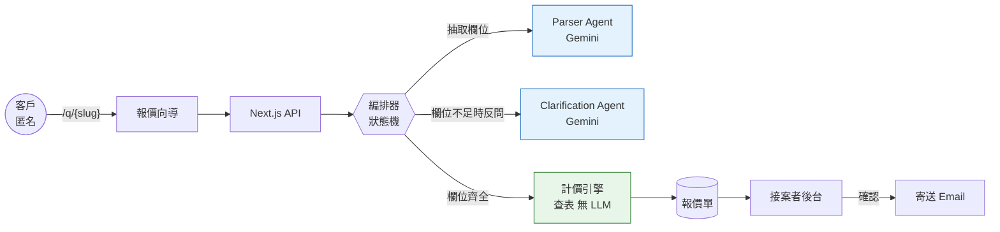

<div align="center">

# BizMate

自動報價 AI Agent。客戶用一段話描述需求，系統解析為結構化欄位、以確定性引擎計算金額，接案者審核後寄出正式報價單。

[](https://github.com/ychsieh725/BizMate/actions/workflows/ci.yml)
[](https://github.com/ychsieh725/BizMate/actions/workflows/eval.yml)


</div>

---

## 成果

### LLM 輸出品質可量測且會擋合併

36 則人工標註資料集，11 項指標，每次觸及模型相關路徑的變更都會對真實 Gemini 執行完整資料集並判定門檻，未達標即擋下合併。

| 指標 | 基準線 | CI 門檻 |
| --- | --- | --- |
| 欄位抽取準確率 | 98.5% | 不低於 95.77% |
| 欄位抽取 F1 | 98.0% | 不低於 95.77% |
| 缺漏判定 Precision / Recall | 100% / 100% | Recall 不低於 93.24% |
| 幻覺率 | 0% | 必須為 0 |
| 端到端成功率 | 100% | 不低於 90.36% |
| 報價偏差最大值 | 0% | 不高於 10% |
| 每案成本 | $0.00048 | 僅警告 |

門檻取 Wilson 95% 信賴區間下界而非觀測值。閘門本身以兩份實測落檔測試，修復前那份必須被擋、修復後那份必須放行。

### 標註資料集攔截到測試漏掉的計價缺陷

專案累積到 424 個綠燈單元測試與一條通過的端對端金路徑時，一個會導致報價失敗的缺陷仍存在於程式碼中，所有測試都沒有攔截。36 則資料集在首次執行時攔截了。修復後同一份資料集量到的欄位抽取準確率由 81.4% 提升至 97.1%。

第二個缺陷由後續的對照實測攔截，症狀是單則報價金額算成八倍，報價偏差 700%。修復後最大偏差降為 0%。

[完整過程](docs/eval-driven-fix-case-study.md)

### Tool-Calling Agent 完成實作與統計對照

自行實作 tool-calling 迴圈，四個工具分為查詢類與終止類，含軌跡記錄、護欄與三重預算控制。與原有單步流程進行 McNemar 配對檢定。

| 判準 | 單步流程 | Agent | McNemar p |
| --- | --- | --- | --- |
| 報價正確 | 100% | 100% | 1.0000 |
| 欄位全對 | 91.7% | 91.7% | 1.0000 |
| 缺漏判定一致 | 100% | 97.2% | 1.0000 |

品質持平，成本為三倍，客戶被問的題數未減少。feature flag 維持關閉。

[基準線對照](docs/agent-eval-a6-comparison.md) ｜ [軌跡案例研究](docs/agent-trajectory-case-study.md)

### 金額不經過 LLM

| 不變式 | 內容 |
| --- | --- |
| I-1 | 金額不經過 LLM。計價工具宣告為零參數，模型無法夾帶影響金額的資料 |
| I-2 | 缺漏判定不經過 LLM。以 confidence 門檻在程式端計算 |
| I-3 | 任何異常退回既有路徑。agent 失敗時行為與導入前完全一致 |

### 工程規模

| 項目 | 數字 |
| --- | --- |
| TypeScript | 217 檔，19,303 行，strict，禁用 any |
| Python | 78 檔，8,768 行，mypy strict |
| 測試 | TypeScript 672 則，Python 329 則 |
| 覆蓋率 | 96.4% 與 90.6% statements，門檻 80% 由 CI 把關 |
| 資料庫 | 15 張表，10 個 migrations，RLS 全表啟用 |
| 驗證腳本 | 17 支，其中 9 支純資料庫的隔離驗證已進入 CI |

---

## 系統



綠色區塊完全不經過 LLM。藍色區塊由模型負責，也就是理解發散的自然語言與生成自然的追問句子。

| 層 | 技術 |
| --- | --- |
| 前端與後端 | Next.js 16 App Router、React 19、TypeScript strict、Tailwind CSS v4 |
| AI 服務 | Python 3.12、FastAPI、pydantic、mypy strict |
| 模型 | Gemini 3.1 Flash Lite，structured output 與 function calling |
| 資料庫 | Supabase PostgreSQL，Auth、RLS、原子 RPC |
| 外部服務 | Resend |
| 測試 | Vitest、pytest、Playwright |
| CI 與部署 | GitHub Actions、Vercel |

---

## 現況與限制

| 項目 | 狀態 |
| --- | --- |
| Tool-calling agent | 實作完成，feature flag 關閉，依據為統計對照結果 |
| agent-service 部署 | 僅於本機與離線 eval 執行 |
| Email 寄送 | Resend 網域驗證未完成，目前只能寄給帳號持有人 |
| 資料集規模 | 36 則，統計功效有限，可偵測的效應量已寫入對照報告 |
| 延遲指標 | 單次量測變異達 8.7 倍，目前僅作為警告 |

---

## 本機執行

環境需求為 macOS 或 Linux、Node.js 20 以上、pnpm。

```bash
pnpm install
cp .env.example .env.local   # 填入 Supabase、Gemini、Resend 金鑰
pnpm dev                     # http://localhost:3000

pnpm test                    # 單元測試
pnpm test:coverage           # 覆蓋率，門檻 80%
pnpm test:e2e                # Playwright 端對端測試
pnpm eval                    # 對真實 pipeline 執行 golden set 並計算 11 項指標
pnpm eval:gate run.json      # 對基準線判定，硬門檻未達回離開碼 1
```

AI 層為獨立服務。

```bash
cd agent-service
uv sync
uv run pytest                                # 單元測試與覆蓋率
uv run python -m eval.runner --out a.json    # 對真實 agent 執行 golden set
uv run python -m eval.compare b.json a.json  # 與 baseline 配對比較
```

---

## 延伸閱讀

| 文件 | 內容 |
| --- | --- |
| [用 Golden Set 抓出並修復 Parser 值域缺陷](docs/eval-driven-fix-case-study.md) | 本專案核心的工程敘事 |
| [A6 基準線對照](docs/agent-eval-a6-comparison.md) | agent 與單步流程的配對統計檢定與上線判定 |
| [軌跡與統計檢定否決一次上線](docs/agent-trajectory-case-study.md) | agent 從未運作過、護欄的自我修正、資料否決功能本身 |
| [後台效能修復](docs/dashboard-perf-fix-case-study.md) | 效能問題的定位與修復過程 |
| [新手導讀](docs/guide/README.md) | 大局觀、程式碼地圖、追一筆報價、全域模式、開發流程，共 5 篇 |
| [部署 Runbook](docs/deployment.md) | Vercel、Supabase、Resend 的上線手冊 |
| [PRD 與 SAD 與 SDS](documents/) | 需求、架構、詳細設計文件 |
